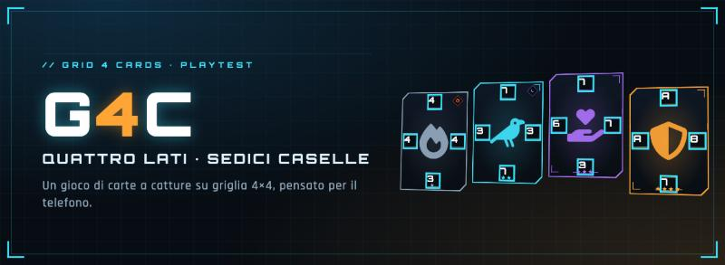
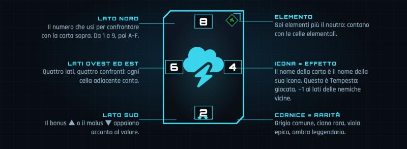
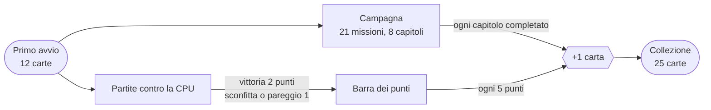
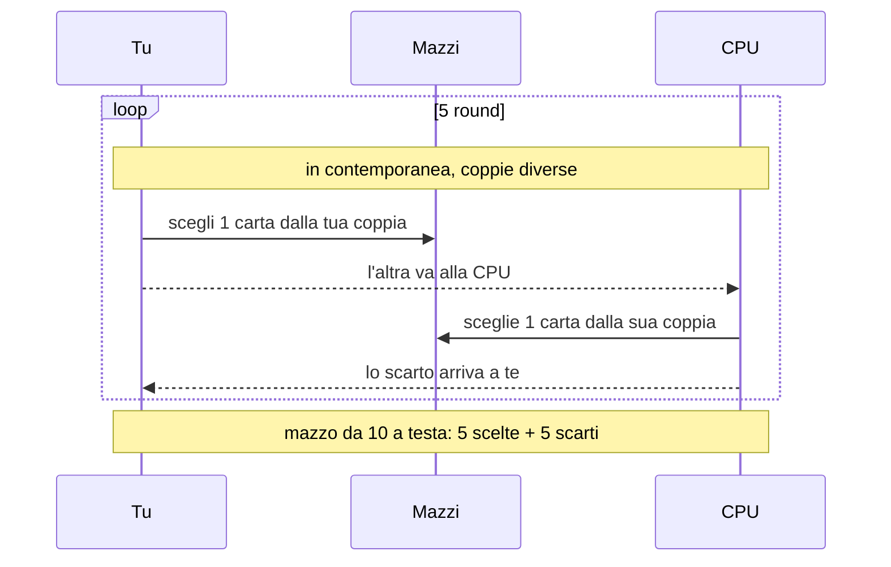

 

**Un gioco di carte a catture su griglia 4×4, pensato per il telefono.** 
Si impara in trenta secondi, ma ogni mossa può ribaltare il tabellone.

[Come si gioca](#come-si-gioca) · [Le regole](#le-regole-che-si-combinano) · [Le carte](#le-carte) · [Progressione](#progressione-e-sblocchi) · [Draft](#draft-a-scelte-nascoste) · [Sotto il cofano](#sotto-il-cofano)

 

   

---

## Come si gioca

Piazzi una carta su una cella libera. Ogni carta ha **quattro lati** con un numero: se il lato che tocca una carta nemica è **più alto** del suo lato opposto, la catturi e diventa tua. Fine. Il resto è decidere *dove* e *con quale carta*.

**Un turno, passo per passo**

1. **Inizio turno** · peschi una carta (la mano parte da 3) e scattano gli effetti di inizio turno.
2. **Piazzamento** · trascini la carta su una cella. Prima di confermare vedi l'**anteprima** di cosa cambierebbe.
3. **Catture** · si risolvono in ordine: Same, Plus, base, Combo.
4. **Fine turno** · scattano gli effetti di fine turno; passa all'avversario.

Dopo **8 turni a testa** (o a tabellone pieno) vince chi ha più carte sul campo. Puoi anche passare il turno: conta come turno usato.

> **Anteprima prima di decidere.** Dopo aver piazzato la carta, e prima di concludere, il tabellone mostra le carte che cambierebbero proprietario, la causa (CATTURA, SAME, PLUS, COMBO…) e il punteggio previsto. Se non ti convince, la sposti o la riporti in mano.

## Le regole che si combinano

La base è sempre attiva; le altre quattro sono interruttori che puoi accendere come vuoi.

| Regola | Cosa succede |
|---|---|
| **Base** | Il tuo lato è più alto del lato opposto della nemica: la catturi. |
| **Same** | Almeno due vicine hanno il lato opposto **uguale** al tuo: le catturi tutte. |
| **Plus** | Almeno due coppie di lati danno la **stessa somma**: catturi il gruppo. |
| **Combo** | Le carte catturate da Same o Plus **attaccano a loro volta** i vicini, a catena. Richiede Same o Plus. |
| **Elementi** | Sei elementi più il neutro. Su una cella del tuo elemento ricevi +1 a tutti i lati; su un elemento diverso, o se sei neutra, −1. |

I numeri vanno da 1 a 9 e poi in **esadecimale**: A = 10, B = 11 … F = 15. I valori da A in su sono riservati alle leggendarie.

## Le carte

**25 carte attive**: 10 comuni, 8 rare, 5 epiche, 2 leggendarie. Ogni carta ha il **nome della sua icona** e un effetto che ne spiega il carattere. Gli effetti sono veri, non decorativi: una **Corazza** annulla la prima cattura subita, un'**Aura** altera i lati dei vicini finché la carta resta sul campo, altri effetti scattano alla giocata o a inizio e fine turno, pescano carte o indeboliscono per sempre un nemico.

<b>Mostra tutte le 25 carte</b>

 

| Carta | Rarità | Elemento | N · E · S · O | Effetto |
|---|---|---|---|---|
| **Baluardo** | Leggendaria | Neutro | A · 8 · 7 · A | Corazza. Giocata: pesca 1 carta. |
| **Sole** | Leggendaria | Luce | A · 7 · 9 · 7 | Aura: alleate adiacenti +1 a tutti i lati. |
| **Ancora** | Epica | Acqua | 6 · 7 · 4 · 6 | Aura: alleate Acqua adiacenti +1 a tutti i lati. |
| **Esplosione** | Epica | Fuoco | 7 · 5 · 3 · 7 | Giocata: +3 a tutti i lati solo per i confronti di questo turno. |
| **Martello** | Epica | Vento | 8 · 7 · 2 · 7 | Giocata: -2 ai lati rivolti verso questa carta della nemica adiacente più forte (permanente). |
| **Sostegno** | Epica | Neutro | 7 · 7 · 3 · 6 | Giocata: +1 permanente a tutti i lati dell'alleata adiacente più debole. |
| **Teschio** | Epica | Ombra | 8 · 7 · 2 · 7 | Cattura: quando cattura una carta, +1 a tutti i lati (permanente, max +3). |
| **Corvo** | Rara | Ombra | 7 · 3 · 7 · 3 | Aura: nemiche adiacenti -1 al lato rivolto verso questa carta. |
| **Libro** | Rara | Luce | 4 · 6 · 4 · 4 | Giocata: pesca 1 carta. |
| **Pioggia** | Rara | Acqua | 5 · 4 · 4 · 5 | Inizio turno: alleate Acqua adiacenti +1 a tutti i lati fino a fine turno. |
| **Piuma** | Rara | Neutro | 5 · 5 · 5 · 4 | Fine turno: +1 a tutti i lati dell'alleata adiacente più debole (max +2). |
| **Pugno** | Rara | Fuoco | 7 · 6 · 2 · 4 | Giocata: +2 al lato più alto solo per questo turno. |
| **Scudo** | Rara | Luce | 7 · 4 · 4 · 4 | Corazza. |
| **Seme** | Rara | Terra | 5 · 5 · 5 · 4 | Fine turno: +1 a tutti i lati di sé (max +2). |
| **Tempesta** | Rara | Vento | 8 · 4 · 2 · 6 | Giocata: -1 a tutti i lati delle nemiche adiacenti fino a fine turno. |
| **Chiave** | Comune | Neutro | 5 · 2 · 5 · 4 | — |
| **Dado** | Comune | Neutro | 4 · 5 · 4 · 4 | — |
| **Fiamma** | Comune | Fuoco | 4 · 4 · 3 · 4 | — |
| **Foglia** | Comune | Terra | 5 · 5 · 5 · 3 | — |
| **Goccia** | Comune | Acqua | 6 · 7 · 2 · 3 | — |
| **Luna** | Comune | Ombra | 6 · 4 · 3 · 4 | — |
| **Montagna** | Comune | Terra | 3 · 6 · 3 · 4 | — |
| **Onda** | Comune | Acqua | 4 · 6 · 2 · 4 | — |
| **Stella** | Comune | Luce | 7 · 4 · 3 · 4 | — |
| **Vento** | Comune | Vento | 8 · 3 · 4 · 3 | — |

*Lati nell'ordine nord · est · sud · ovest, in esadecimale.*

Un mazzo ha **10 carte**, al massimo **1 leggendaria e 2 epiche**; puoi salvare fino a 5 mazzi sul dispositivo.

## Progressione e sblocchi

Parti con **12 carte casuali** tra le comuni e le rare. Le altre sono silhouette grigie finché non le guadagni.

La pagina di fine partita ti mostra quanto manca alla prossima carta. Lo sblocco è casuale, con le rarità alte più difficili da ottenere.

**La campagna è un tutorial**, non un obbligo: puoi sfidare la CPU fin dal primo avvio. Sono rompicapo brevi, uno per concetto: cattura base, numeri esadecimali, passare, Same, Plus, Combo, Elementi, effetti delle carte, mazzi e Draft.

**Tre livelli di CPU.** La Facile gioca con carte comuni e rare e sceglie a caso; la Media può usare anche le epiche; la Alta arriva alle leggendarie e sceglie quasi sempre la carta più forte.

## Draft a scelte nascoste

Una modalità per esplorare anche le carte che non hai ancora: il Draft usa tutte le 25 carte attive.

Non vedi le scelte della CPU né gli scarti che ricevi: durante il Draft il tuo mazzo visibile è solo la metà che hai scelto tu. Alla fine scopri tutto in un riepilogo.

## Sotto il cofano

- **Un solo file** `index.html`: HTML, CSS e JavaScript, nessuna libreria e nessuna fase di build.
- **Interfaccia HUD sci-fi** disegnata solo in CSS: nessuna immagine di sfondo. Gli effetti (rimbalzo, cattura con riflesso, anteprima, modale) usano solo `transform` e `opacity` e si spengono con "riduci movimento".
- **Rendering per cella**: il tabellone aggiorna solo le carte che cambiano.
- **Font e icone incorporati** nel file: nessuna dipendenza da servizi esterni.
- **Salvataggio locale**: collezione, punti, campagna e mazzi stanno in `localStorage`. Non c'è un server, quindi i progressi restano sul dispositivo e in navigazione privata possono non salvarsi.

## Stato e feedback

Questo è un **prototipo di playtest**: serve a mettere alla prova regole, bilanciamento e flusso prima di pensare a una versione nativa per iOS e Android. Molti numeri sono ipotesi da verificare giocando: probabilità di sblocco, forza delle carte, durata delle partite.

Hai giocato? A fine partita apri **Statistiche partita e log** e tocca **Copia log partita (JSON)**: contiene mosse, catture e tempi di decisione. Incollalo dove vuoi segnalarmi cosa funziona e cosa no.

## Crediti

- Icone: [Font Awesome Free](https://fontawesome.com/license/free) (CC BY 4.0).
- Font: [Orbitron](https://fonts.google.com/specimen/Orbitron) e [Rajdhani](https://fonts.google.com/specimen/Rajdhani) (SIL Open Font License 1.1).
- Game design e sviluppo del prototipo: un progetto portato avanti da due persone nel tempo libero.

Licenza del codice e dei contenuti non ancora definita: per ora tutti i diritti sono riservati.
