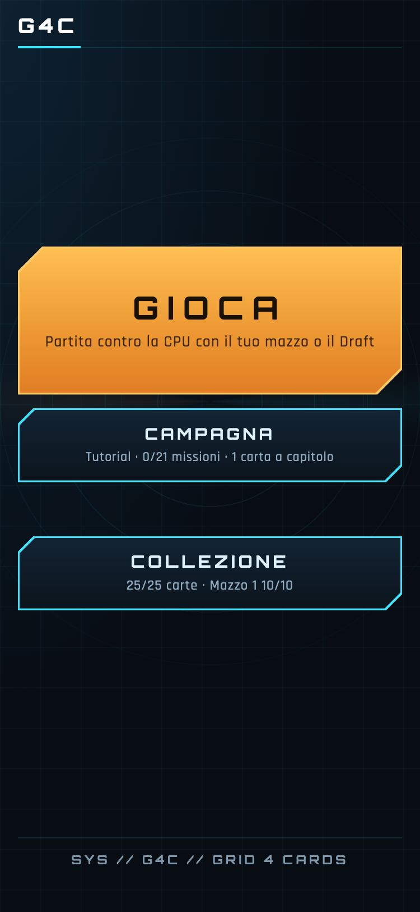
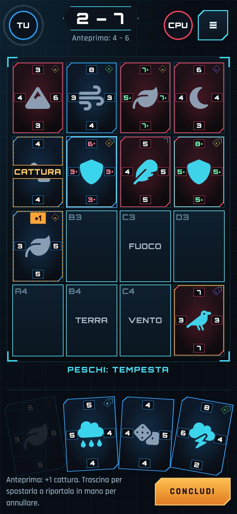
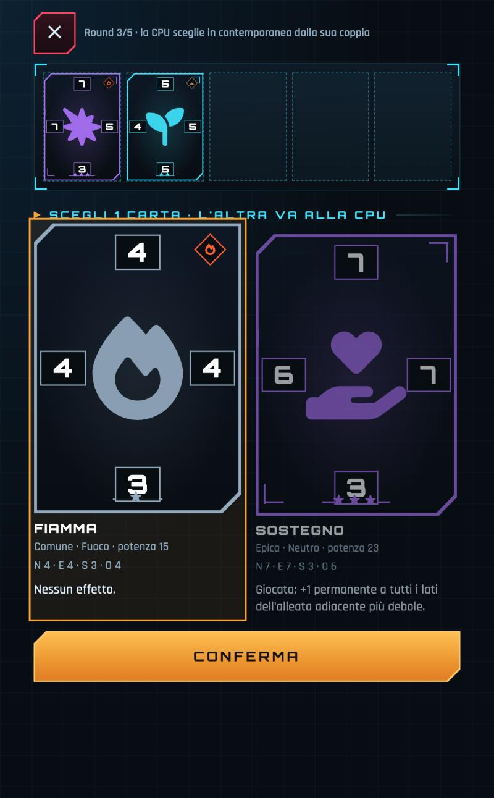
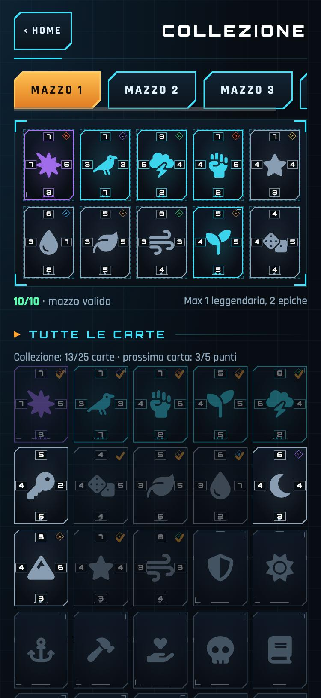

<div align="center">

# G4C · Grid 4 Cards

**Un gioco di carte a catture su una griglia 4×4, pensato per il telefono.**
Quattro numeri per carta, sedici caselle, una battaglia tattica da cinque minuti.

### [▶ Gioca subito nel browser](https://politialex.github.io/ingranaggi-arcani/)

*Prototipo di playtest · un solo file HTML · nessuna installazione, nessun account*

<br>

   

</div>

---

## L'idea in trenta secondi

Ogni carta ha **quattro lati** (nord, est, sud, ovest), ognuno con un valore. Piazzi una carta accanto a una nemica: se il tuo lato di contatto è **più alto** del suo, la catturi e diventa tua. Dopo 8 turni a testa vince chi ha più carte sul tabellone.

```
        N
     ┌─────┐
   O │  ◆  │ E        valori: 1 2 3 4 5 6 7 8 9 A B C D E F
     └─────┘                              (A = 10 … F = 15)
        S
```

Semplice da imparare, ma le regole opzionali e gli effetti delle carte cambiano il modo di ragionare a ogni mossa.

## Cosa c'è dentro

### Regole che si combinano
| Regola | Cosa fa |
|---|---|
| **Base** | Il lato più alto cattura il lato opposto della nemica. |
| **Same** | Se almeno due vicine hanno il lato opposto **uguale** al tuo, le catturi tutte. |
| **Plus** | Se almeno due coppie di lati danno la **stessa somma**, catturi il gruppo. |
| **Combo** | Le carte catturate da Same o Plus attaccano a loro volta i vicini: catene di catture. |
| **Elementi** | Sei elementi più il neutro. Sulla cella del tuo elemento +1 a tutti i lati, su un elemento diverso (o per le neutre) −1. |

### Carte con personalità
- **25 carte attive**: 10 comuni, 8 rare, 5 epiche, 2 leggendarie.
- Ogni carta ha il nome e l'icona del suo effetto: *Scudo*, *Tempesta*, *Corvo*, *Seme*, *Martello*…
- Effetti veri, non decorativi: **Corazza** che annulla una cattura, **Aure** che cambiano i lati dei vicini, bonus a inizio e fine turno, pescate extra, malus permanenti.
- La rarità si legge dalla cornice; l'elemento sta nell'angolo in alto a destra; in partita il bordo è blu per te e rosso per la CPU.

### Anteprima prima di decidere
Dopo aver piazzato la carta, e **prima di concludere il turno**, il tabellone mostra cosa succederebbe: le carte che cambiano proprietario, la causa (CATTURA, SAME, PLUS, COMBO) e il punteggio previsto. Puoi spostarla o annullare.

### Collezione da guadagnare
Parti con **12 carte casuali** tra le meno rare; le altre sono silhouette grigie.
- **1 carta nuova per ogni capitolo** della campagna (8 capitoli);
- **ogni 5 punti** contro la CPU: vittoria = 2 punti, sconfitta o pareggio = 1. La pagina di fine partita mostra quanto manca.

### Campagna come tutorial
**21 missioni** in 8 capitoli, a piccoli rompicapo: ognuna insegna una regola alla volta (cattura base, numeri esadecimali, passare, Same, Plus, Combo, Elementi, effetti, mazzi, draft). Non è obbligatoria: puoi sfidare la CPU fin dal primo avvio.

### Draft a scelte nascoste
5 round. In ogni round vedi una coppia di carte e ne scegli una: **l'altra va alla CPU**. In contemporanea la CPU fa lo stesso con la sua coppia e il suo scarto va a te. Non vedi le sue scelte, né gli scarti che ricevi, fino alla fine. Risultato: un mazzo da 10 carte per ciascuno, fatto di 5 scelte e 5 scarti dell'avversario.

### Avversario in tre livelli
**Facile** (mazzo di carte comuni e rare, scelte a caso), **Media**, **Alta** (mazzi più forti, scelte quasi per potenza pura).

### Deck building
Mazzi da **10 carte**, al massimo **1 leggendaria e 2 epiche**; fino a 5 mazzi salvati sul dispositivo.

## Sotto il cofano

- **Un solo file** (`index.html`): HTML, CSS e JavaScript senza librerie e senza build.
- **Interfaccia HUD sci-fi** disegnata solo con CSS: nessuna immagine di sfondo, effetti e animazioni su `transform` e `opacity` (rispettano "riduci movimento").
- Rendering del tabellone **per cella**: si aggiornano solo le carte che cambiano.
- Font e icone **incorporati** nel file: nessuna dipendenza da servizi esterni.
- Progressi salvati in `localStorage` (collezione, punti, campagna, mazzi): restano sul dispositivo, non c'è un server.

## Stato del progetto

È un **prototipo di playtest**, non il prodotto finale: serve a mettere alla prova regole, bilanciamento e flusso prima di una versione nativa per iOS e Android. Alcune cose sono ipotesi da verificare giocando (probabilità degli sblocchi, forza delle carte, durata delle partite).

Se giochi e hai dei commenti, a fine partita puoi toccare **"Copia log partita (JSON)"** dalle statistiche e incollarlo: contiene mosse, catture e tempi di decisione.

## Crediti

- Icone: [Font Awesome Free](https://fontawesome.com/license/free) (CC BY 4.0).
- Font: [Orbitron](https://fonts.google.com/specimen/Orbitron) e [Rajdhani](https://fonts.google.com/specimen/Rajdhani) (SIL Open Font License 1.1).
- Progetto di game design portato avanti da due persone nel tempo libero.

*Licenza del codice e dei contenuti non ancora definita: per ora tutti i diritti sono riservati.*
